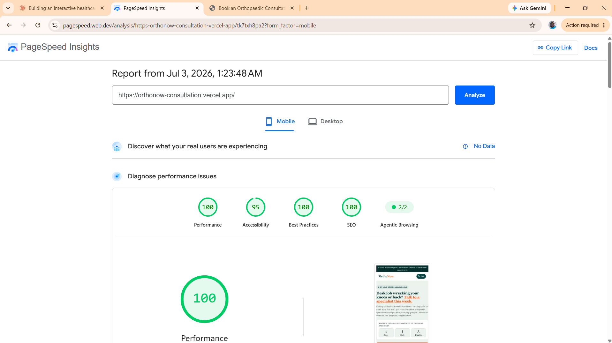

# 🦴 OrthoNow — Developer Assignment

> GTM event tracking, a conversion-focused landing page, and a HubSpot/WhatsApp lead integration for OrthoNow — a 9-clinic orthopaedic chain across Bengaluru, Hyderabad, and Chennai.
>
> Built for **Namoza Digital Growth** · Developer – Position 1 (Client Web + Martech)

**🔗 Live page:** [orthonow-consultation.vercel.app](https://orthonow-consultation.vercel.app)

---

## 📁 What's in here

| Task | What it is | Where |
|---|---|---|
| **01** | Full GTM event schema, booking-funnel dataLayer JSON, Google Ads conversion pick | [`task1/GTM_Event_Schema.md`](./task1/GTM_Event_Schema.md) |
| **02** | Single-file landing page, deployed live on Vercel | [`task2/index.html`](./task2/index.html) |
| **03** | HubSpot/WhatsApp/Google Ads integration architecture + a real serverless function | [`task3/README.md`](./task3/README.md) · [`task2/api/submit-lead.js`](./task2/api/submit-lead.js) |

---

## 🎯 Task 01 — GTM Event Schema

A 9-event schema covering the booking funnel, Call Now clicks, WhatsApp widget, guide downloads, clinic pages, and blog scroll depth — plus the three-step booking funnel's exact `dataLayer.push()` payloads as real JSON.

The short version of the one thing that actually matters here: **GTM can't see inside a multi-step form on its own.** It only reacts to what the front-end pushes to `window.dataLayer` — so step-by-step funnel tracking only works because the dev fires that push manually at each step. Full reasoning in the doc.

➡️ [Read the full schema](./task1/GTM_Event_Schema.md)

---

## 🖥️ Task 02 — Landing Page

Rebuilt "Book a Consultation" page for working professionals (28–50) in Bengaluru dealing with knee or back pain from desk jobs. Vanilla HTML/CSS/JS, single self-contained file, zero external dependencies — no webfonts, no images, no frameworks.

**Highlights:**
- 🩹 Pain-selector tool (knee / back / shoulder → matched specialist) as the signature interaction
- 📉 UTM + gclid capture baked into the submit payload, so leads carry real attribution
- ✅ `dataLayer.push()` fires on submit (not page load), logged to console — verifiable live
- 📱 Built mobile-first, not just shrunk down from desktop
- 🎈 Real clinic-location marquee and a scroll-aware header — small interaction details, zero extra dependencies

### 📊 PageSpeed Insights — Mobile

  

Tested against the real deployed URL, throttled to Slow 4G on an emulated Moto G Power — not just fast on a dev machine.

➡️ [View the page live](https://orthonow-consultation.vercel.app) · [View the code](./task2/index.html)

---

## 🔗 Task 03 — Integration Architecture

Written answer covering the end-to-end HubSpot → WhatsApp (Karix) → Google Ads flow, the biggest failure point and its fallback, and the SLA monitoring approach for the 2-minute WhatsApp confirmation.

The trap worth flagging up front: **HubSpot's default contact dedup runs on email — this form never collects one.** The full write-up covers exactly what happens when two patients submit the same phone number with different names, and why.

A real (not just described) serverless function backs this up at [`task2/api/submit-lead.js`](./task2/api/submit-lead.js) — it runs actual phone-normalization, a HubSpot Contacts Search lookup, and per-phone rate limiting, and returns its real decision even without live HubSpot credentials.

➡️ [Read the full write-up](./task3/README.md)

---

## 🛠️ Running it locally

`task2/index.html` needs nothing — no `npm install`, no build step. Open it directly in a browser, or use VS Code's Live Server extension for auto-reload while editing.

To watch the `dataLayer` push fire: open DevTools → Console, fill in the form, hit submit. Append `?debug=1` to the URL for an on-page event log too (hidden by default — a real patient shouldn't see a JSON log on a booking page).

---

Namoza Private Limited · Developer Assignment Submission
